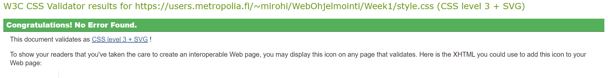
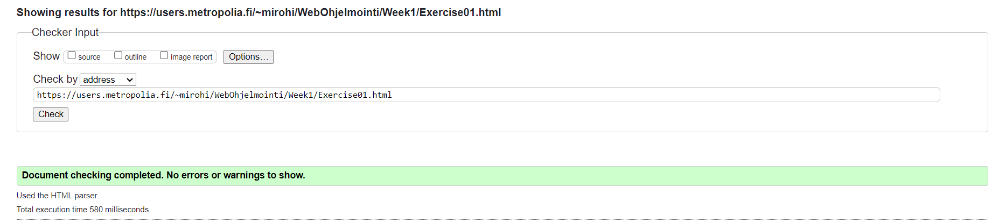

<h1>Week 1</h1>
<h2>Exercise 1</h2>
<h3>Links</h3>
<ul>
    <li><a href="https://users.metropolia.fi/~mirohi/WebOhjelmointi/Week1/Exercise01.html">HTML exercise</a></li>
    <li><a href="https://users.metropolia.fi/~mirohi/WebOhjelmointi/Week1/style.css">CSS exercise</a> </li>
</ul>

<h3>Validates</h3>

